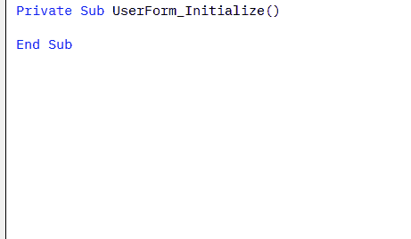

# VBA TextBox Styling

It is very simple to implement this class in your project

# Sobre

Neste Projeto desejo trazer uma ferramenta de desenvolvimento e estilização de seus formulário VBA.  
Além de lhe economizar o tempo com os desenho, esta classe aumenta bastante a performance do seu formulário

# Evolução do Projeto

* [Versão 1.0]((#Sobre))
* [Versão 1.4.6](https://raw.githubusercontent.com/ricardocamisa/rcTextBox/main/ClsTextBox%20Version%201.4.6.zip)
* [Versão beta]((#versaobeta))

# Como configurar?

1º Passo

Baixe o arquivo Zip e extraia os dois módulos 

2º Passo

Importe a classe para dentro do seu projeto VBE

3º Passo
 

No evento UserForm_Initialize() invoque este código, "Call cBox.clasBox(Me)", isto funciona para todos os formulários que desejares utilizar no seu projeto.

<h1 align="center">
    
</h1>

### Features

- [x] Criar efeito MouseMove e Resetar campos vazios
- [x] Subir o título ao digitar no campo 
- [x] Subir o título ao clicar no campo
- [x] Permitir funcionalidade diretamente do formulário
- [x] Trabalhar o evento Exit_Sub do campo
- [x] Permitir personalizar as cores

